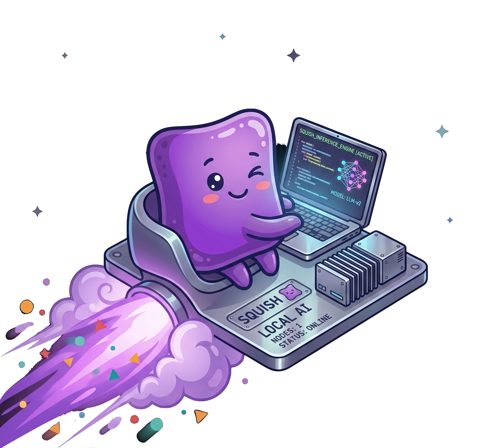

<div align="center">


# Squish

**The fastest way to run local LLMs on Apple Silicon.**

Sub-second model loads. Beats Ollama on throughput, tail latency, and full-response time. One OpenAI/Ollama-compatible daemon — no cloud, no API keys, fully offline.

[](LICENSE)
[](https://pypi.org/project/squish-ai/)
[](https://pypi.org/project/squish-ai/)
[](https://github.com/konjoai/homebrew-squish)
[](https://github.com/konjoai/squish)
[](https://github.com/konjoai/squish/actions/workflows/ci.yml)
[](https://github.com/konjoai/squish/actions/workflows/konjo-gate.yml)
[](https://github.com/konjoai/squish/actions/workflows/ci.yml)
[](https://github.com/astral-sh/ruff)
[](https://squish.run)
[](https://huggingface.co/squishai)
[![OpenAI API compatible](https://img.shields.io/badge/OpenAI%20API-compatible-412991?logo=data%3Aimage%2Fsvg%2Bxml%3Bbase64%2CPHN2ZyB4bWxucz0iaHR0cDovL3d3dy53My5vcmcvMjAwMC9zdmciIHZpZXdCb3g9IjAgMCAyNCAyNCIgZmlsbD0id2hpdGUiPjxwYXRoIGQ9Ik0yMi4yODE5IDkuODIxMWE1Ljk4NDcgNS45ODQ3IDAgMCAwLS41MTU3LTQuOTEwOCA2LjA0NjIgNi4wNDYyIDAgMCAwLTYuNTA5OC0yLjlBNi4wNjUxIDYuMDY1MSAwIDAgMCA0Ljk4MDcgNC4xODE4YTUuOTg0NyA1Ljk4NDcgMCAwIDAtMy45OTc3IDIuOSA2LjA0NjIgNi4wNDYyIDAgMCAwIC43NDI3IDcuMDk2NiA1Ljk4IDUuOTggMCAwIDAgLjUxMSA0LjkxMDcgNi4wNTEgNi4wNTEgMCAwIDAgNi41MTQ2IDIuOTAwMUE1Ljk4NDcgNS45ODQ3IDAgMCAwIDEzLjI1OTkgMjRhNi4wNTU3IDYuMDU1NyAwIDAgMCA1Ljc3MTgtNC4yMDU4IDUuOTg5NCA1Ljk4OTQgMCAwIDAgMy45OTc3LTIuOTAwMSA2LjA1NTcgNi4wNTU3IDAgMCAwLS43NDc1LTcuMDcyOXptLTkuMDIyIDEyLjYwODFhNC40NzU1IDQuNDc1NSAwIDAgMS0yLjg3NjQtMS4wNDA4bC4xNDE5LS4wODA0IDQuNzc4My0yLjc1ODJhLjc5NDguNzk0OCAwIDAgMCAuMzkyNy0uNjgxM3YtNi43MzY5bDIuMDIgMS4xNjg2YS4wNzEuMDcxIDAgMCAxIC4wMzguMDUydjUuNTgyNmE0LjUwNCA0LjUwNCAwIDAgMS00LjQ5NDUgNC40OTQ0em0tOS42NjA3LTQuMTI1NGE0LjQ3MDggNC40NzA4IDAgMCAxLS41MzQ2LTMuMDEzN2wuMTQyLjA4NTIgNC43ODMgMi43NTgyYS43NzEyLjc3MTIgMCAwIDAgLjc4MDYgMGw1Ljg0MjgtMy4zNjg1djIuMzMyNGEuMDgwNC4wODA0IDAgMCAxLS4wMzMyLjA2MTVMOS43NCAxOS45NTAyYTQuNDk5MiA0LjQ5OTIgMCAwIDEtNi4xNDA4LTEuNjQ2NHpNMi4zNDA4IDcuODk1NmE0LjQ4NSA0LjQ4NSAwIDAgMSAyLjM2NTUtMS45NzI4VjExLjZhLjc2NjQuNzY2NCAwIDAgMCAuMzg3OS42NzY1bDUuODE0NCAzLjM1NDMtMi4wMjAxIDEuMTY4NWEuMDc1Ny4wNzU3IDAgMCAxLS4wNzEgMGwtNC44MzAzLTIuNzg2NUE0LjUwNCA0LjUwNCAwIDAgMSAyLjM0MDggNy44NzJ6bTE2LjU5NjMgMy44NTU4TDEzLjEwMzggOC4zNjQgMTUuMTE5MiA3LjJhLjA3NTcuMDc1NyAwIDAgMSAuMDcxIDBsNC44MzAzIDIuNzkxM2E0LjQ5NDQgNC40OTQ0IDAgMCAxLS42NzY1IDguMTA0MnYtNS42NzcyYS43OS43OSAwIDAgMC0uNDA3LS42Njd6bTIuMDEwNy0zLjAyMzFsLS4xNDItLjA4NTItNC43NzM1LTIuNzgxOGEuNzc1OS43NzU5IDAgMCAwLS43ODU0IDBMOS40MDkgOS4yMjk3VjYuODk3NGEuMDY2Mi4wNjYyIDAgMCAxIC4wMjg0LS4wNjE1bDQuODMwMy0yLjc4NjZhNC40OTkyIDQuNDk5MiAwIDAgMSA2LjY4MDIgNC42NnpNOC4zMDY1IDEyLjg2M2wtMi4wMi0xLjE2MzhhLjA4MDQuMDgwNCAwIDAgMS0uMDM4LS4wNTY3VjYuMDc0MmE0LjQ5OTIgNC40OTkyIDAgMCAxIDcuMzc1Ny0zLjQ1MzdsLS4xNDIuMDgwNUw4LjcwNCA1LjQ1OWEuNzk0OC43OTQ4IDAgMCAwLS4zOTI3LjY4MTN6bTEuMDk3Ni0yLjM2NTRsMi42MDItMS40OTk4IDIuNjA2OSAxLjQ5OTh2Mi45OTk0bC0yLjU5NzQgMS40OTk3LTIuNjA2Ny0xLjQ5OTd6Ii8%2BPC9zdmc%2B&logoColor=white)](https://squish.run)
[](https://squish.run)
[](https://github.com/konjoai/squish/stargazers)

</div>

---

```
  ███████╗██╗  ██╗██╗  ██╗         █████╗     █████╗ ██╗  ██╗        ██████╗ ██████╗ ██╗ ██╗
  ██╔════╝██║  ██║╚██╗██╔╝        ██╔══██╗   ██╔══██╗╚██╗██╔╝        ╚════██╗╚════██╗╚═╝██╔╝
  ███████╗███████║ ╚███╔╝         ╚██████║   ╚█████╔╝ ╚███╔╝          █████╔╝ █████╔╝  ██╔╝
  ╚════██║╚════██║ ██╔██╗          ╚═══██║   ██╔══██╗ ██╔██╗          ╚═══██╗██╔═══╝  ██╔╝
  ███████║     ██║██╔╝ ██╗         █████╔╝██╗╚█████╔╝██╔╝ ██╗        ██████╔╝███████╗██╔╝██╗
  ╚══════╝     ╚═╝╚═╝  ╚═╝         ╚════╝ ╚═╝ ╚════╝ ╚═╝  ╚═╝        ╚═════╝ ╚══════╝╚═╝ ╚═╝
     faster cold start                faster long-prompts                   less RAM

   ██████╗    ███████╗███████╗        ██████╗ ██╗  ██╗        ██╗███╗   ██╗████████╗██████╗
  ██╔═████╗   ██╔════╝██╔════╝        ╚════██╗██║  ██║        ██║████╗  ██║╚══██╔══╝╚════██╗
  ██║██╔██║   ███████╗███████╗         █████╔╝███████║        ██║██╔██╗ ██║   ██║    █████╔╝
  ████╔╝██║   ╚════██║╚════██║        ██╔═══╝ ╚════██║        ██║██║╚██╗██║   ██║    ╚═══██╗
  ╚██████╔╝██╗███████║███████║        ███████╗     ██║        ██║██║ ╚████║   ██║   ██████╔╝
   ╚═════╝ ╚═╝╚══════╝╚══════╝        ╚══════╝     ╚═╝        ╚═╝╚═╝  ╚═══╝   ╚═╝   ╚═════╝
     cold load · 0.33–0.53s         tok/s · beats Ollama              quant default

   ██╗ ██╗███╗   ███╗███████╗        ██████╗    ███████╗ ██████╗          ██╗ ██████╗  ██████╗
  ███║███║████╗ ████║██╔════╝        ╚════██╗   ██╔════╝██╔════╝         ███║██╔═████╗██╔═████╗
  ╚██║╚██║██╔████╔██║███████╗         █████╔╝   ███████╗██║  ███╗        ╚██║██║██╔██║██║██╔██║
   ██║ ██║██║╚██╔╝██║╚════██║        ██╔═══╝    ╚════██║██║   ██║         ██║████╔╝██║████╔╝██║
   ██║ ██║██║ ╚═╝ ██║███████║        ███████╗██╗███████║╚██████╔╝         ██║╚██████╔╝╚██████╔╝
   ╚═╝ ╚═╝╚═╝     ╚═╝╚══════╝        ╚══════╝╚═╝╚══════╝ ╚═════╝          ╚═╝ ╚═════╝  ╚═════╝
     repeat TTFT · KV hit                GB · smaller on disk              inference modules
```

Squish separates how a model's weights are *stored* from how they *run*. Store them compressed and Metal-native; map them straight into unified memory; skip the dtype-conversion pass that makes every other loader slow. The result: a model that's ready in **half a second**, served by a persistent daemon that out-decodes Ollama and never re-does work it's already done.

---

## The Numbers

Measured on an Apple **M3 MacBook Pro, 16 GB** — **thermally controlled** (each engine measured from the same ~50 °C baseline; validated by a first-vs-last drift check ≤ 1.7 % and live die-temperature logging, so the numbers reflect the engines, not the order they ran). Serving: **Qwen2.5-7B-Instruct**, Squish INT4/INT3 vs Ollama `qwen2.5:7b` (Q4_K_M), against **both Ollama 0.18.2 and 0.30.7** (0.30.7 shown; 0.18.2 within noise).

| Metric | Ollama | **Squish** |
|---|---:|---:|
| **Cold start** — load + first token (1.5B) | 20–30 s | **≈ 0.5 s** &nbsp;_(54× load)_ |
| **Full response** @ 4000-token prompt | 37.5 s | **3.8 s** &nbsp;_(9.8× faster)_ |
| **Decode throughput** @ 75 tokens | 20.3 tok/s | **24.0 tok/s** &nbsp;_(INT3)_ |
| **Inter-token tail (p95)** @ 75 tokens | 52.4 ms | **42.7 ms** &nbsp;_(INT3)_ |
| **Repeat-prompt TTFT** (KV cache hit) | ~160 ms | **4–11 ms** |
| **Peak RAM** during inference | 5.14 GB | **3.50 GB** |
| **Disk** — 7B INT4 / INT3 | 4.36 GB / — | **4.00 / 3.56 GB** |
| **Cold short-prompt TTFT** | **167 ms** | 192 ms &nbsp;_(honest loss)_ |

Squish wins decode throughput, inter-token tail latency, full-response time, and RAM — biggest on long contexts, where its KV cache **reuses the prefill instead of re-running it**. INT3 adds ~18 % decode over INT4 at **no measured accuracy cost** (arc_easy `acc_norm` 0.551 vs 0.541, tied). The one place Ollama wins is single-token latency on a *cold, novel* prompt — we say so plainly.

→ Methodology, thermal control, and the full ablation: [`docs/paper.md` §4.4](docs/paper.md) · [`BENCHMARKS.md`](BENCHMARKS.md)

---

## Why Squish

Squish is built for the workload most local-LLM tools aren't tuned for: **the same model called many times an hour, with shifting context** — commit messages, code review, agent loops, multi-turn chat, document Q&A.

On a 16 GB Mac that workload fights the rest of your work. Ollama keeps ~5 GB resident and re-pays a long prefill on every new long prompt. Squish is a **persistent daemon**: the model loads once at login, and a two-cache architecture reuses prefill across requests — so an agent resending a 4,000-token system prompt every turn pays it **once**, not every turn.

Designed for **one developer, one machine**. Not a multi-tenant production API — and the docs never pretend otherwise.

---

<div align="center">


</div>

## Highlights

- **Sub-second cold start** — a three-tier weight cache maps Metal-native bf16 straight into unified memory, eliminating the dtype-conversion + CPU-heap pass that dominates `mlx_lm`/safetensors cold load. **54× faster** than a cold `mlx_lm` load, on **160 MB** of load-phase RAM instead of 2.4 GB.
- **Faster decode than Ollama** — a decoupled decode loop (one inference-thread handoff per request, not per token), GC suspended during generation, and P-core QoS pinning recover throughput the Python serving layer was wasting.
- **Two-cache prefill reuse** — a block-paged KV cache for shifting prefixes plus a prompt KV cache for exact repeats: single-digit-millisecond TTFT on a cache hit.
- **Greedy-lossless speculation** — `--prompt-lookup` verifies a whole n-gram draft in one batched forward, **token-for-token identical to greedy**, ~1.6× faster on repetitive output.
- **INT4 / INT3 / INT8 quantization** — INT3 is the recommended default; family-aware accuracy gates **hard-block** quant configs that would silently degrade.
- **Drop-in compatible** — OpenAI (`/v1/*`) *and* Ollama (`/api/*`) endpoints on one server. Point your existing client at it and go.
- **100+ composable optimization modules** — KV compression, speculative decoding, quantization, attention acceleration, agent tool execution — each an independent flag on a single server.
- **Native macOS surface** — the **SquishBar** menu-bar app (status, tok/s, one-click model switch) and a cinematic **dashboard** ship alongside the CLI.
- **Pre-squished models** — `squish pull` grabs ready-to-run weights from [huggingface.co/squishai](https://huggingface.co/squishai).

---

## Install

Requires Python 3.11–3.14 and macOS 13 (Ventura) or later on Apple Silicon.

```bash
# Homebrew (recommended — no compilation, all deps bundled)
brew tap konjoai/squish
brew install squish
squish doctor

# or pipx
pipx install squish-ai --python python3.13
squish doctor
```

The bundled `squish_quant` Rust extension installs automatically — `squish doctor` confirms it (`✓ squish_quant Rust extension (6 GB/s quantizer)`).

> The PyPI package is `squish-ai`; the CLI and Python module are both `squish`.

---

## Quick Start

```bash
squish pull qwen2.5:7b        # download a pre-squished model
squish run qwen2.5:7b         # start the daemon (loads once, stays resident)
```

Use it from any OpenAI or Ollama client:

```bash
curl http://localhost:11435/v1/chat/completions \
  -H "Content-Type: application/json" \
  -d '{"model":"qwen2.5:7b","messages":[{"role":"user","content":"Hello"}]}'
```

```bash
export OPENAI_BASE_URL=http://localhost:11435/v1   # OpenAI SDKs
export OPENAI_API_KEY=squish
export OLLAMA_HOST=http://localhost:11435           # Ollama clients
```

Browse models and start the daemon at login:

```bash
squish catalog                 # 40 models, 9 pre-squished on the Hub
squish search qwen3
squish pull qwen3:0.6b --int3  # INT3 variant (Qwen3, Qwen2.5, Llama families)
squish daemon install          # macOS LaunchAgent — daemon starts at login
```

---

<div align="center">


</div>

## How it's fast

**Storage ≠ runtime.** Every standard loader pays the same boot tax: allocate a CPU buffer, read the safetensors, convert dtypes, copy to the accelerator — 2–30 s and ~2.4 GB of RAM, almost all of it wasted on bytes that never changed. Squish converts weights **once** into the exact bf16 Metal layout MLX uses, then `mmap`s them directly into the GPU address space. Zero conversion at load time.

**The daemon never re-does work.** A block-paged KV cache persists fixed-size token blocks to disk and reconstructs partial-prefix matches for shifting context; a prompt KV cache catches exact repeats. An agent loop that resends the same long prompt every turn hits the cache instead of re-prefilling.

**Decode is bandwidth-bound, so we attack the right thing.** On Apple Silicon each token streams the whole weight set from unified memory — a hard ceiling. The levers that move it are *fewer weight bytes* (INT3) and *fewer forwards per token* (greedy-lossless prompt-lookup). We measured the levers that *don't* help here (KV-cache quantization, small-draft speculation) and say so in the paper rather than shipping them as wins.

**Accuracy gates are load-bearing.** INT3 holds within ~1 pp of FP16 on Qwen3/Qwen2.5; Gemma-3 collapses (~15 pp). Squish enables INT3 only where it's safe and **refuses** the rest — you can't accidentally ship a config that quietly degrades.

Deep dive: [`docs/ARCHITECTURE.md`](docs/ARCHITECTURE.md) · [`docs/paper.md`](docs/paper.md).

---

## What Squish Doesn't Do

Honesty is a feature. If any of these matter, Ollama or LM Studio is the right call:

- **No GPU outside Apple Silicon.** It's MLX-based; CUDA users want vLLM or llama.cpp.
- **No multi-user serving.** One developer, one machine — not a production API.
- **No multimodal.** Text only.
- **Slower first token on a cold, short prompt** than Ollama (192 ms vs 167 ms) — fundamental MLX prefill kernel cost. Squish's edge is everywhere *else*.
- **Model conversion is slow.** Squish needs models in its own format; first-time conversion takes minutes (`squish pull` skips it with pre-squished weights).

---

## Project

- **Website** — [squish.run](https://squish.run) — full docs, guides, and the benchmark report.
- **Contributing** — [CONTRIBUTING.md](CONTRIBUTING.md). Issues, benchmarks, and PRs welcome.
- **License** — BUSL-1.1, see [LICENSE](LICENSE).
- **Models** — [huggingface.co/squishai](https://huggingface.co/squishai)
- **Docs** — [Architecture](docs/ARCHITECTURE.md) · [Paper](docs/paper.md) · [Benchmarks](BENCHMARKS.md) · [Modules](MODULES.md)
- **Org** — [konjoai](https://github.com/konjoai) · siblings: [Squash](https://github.com/konjoai/squash) (EU AI Act compliance), [Vectro](https://github.com/konjoai/vectro), [Kohaku](https://github.com/konjoai/kohaku)


<div align="center">



</div>
