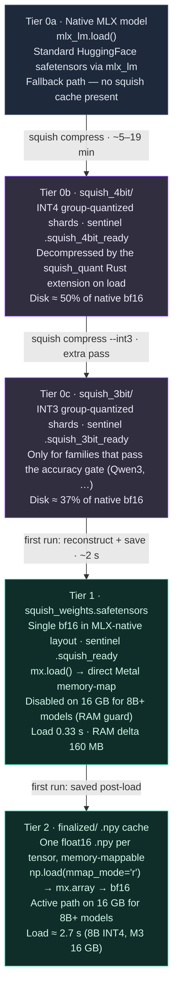

# Squish Architecture: Technical Deep Dive

> **One-sentence summary**: Squish separates the _storage format_ of a transformer's
> weight tensors from their _runtime format_, enabling aggressive compression at rest,
> lossless reconstruction on demand, and Metal-native caching that loads
> a Qwen2.5-1.5B model in **0.33–0.53 seconds** (**54× faster** than a cold
> `mlx_lm` load (28.8 s) and 3.7× faster than a warm one) while using
> **160 MB of peak additional RAM** versus the 2.4 GB typically consumed during
> a standard load.

> **Note**: The Tier 2 MLX safetensors cache requires ~34 GB RAM to build and
> is not built on 16 GB machines. On a standard 16 GB M3, an 8B INT4 model
> loads in ~2.7 seconds via the lut_int2 path. The 0.33–0.53 s figure applies to
> the 1.5B model on hardware with sufficient RAM to build the Tier 2 cache.

---

## 1. The Problem with Status-Quo Model Distribution

Every serious open-source model (Llama, Gemma, Mistral, Qwen, Falcon) ships as
one or more **HuggingFace safetensors shards**.  The format is a flat binary blob:
each tensor is stored in the dtype the training run used (typically bfloat16 or
float16), preceded by a JSON header describing name, dtype, and shape.

This design has several load-time inefficiencies:

| Inefficiency | Root cause |
|---|---|
| Full model in RAM simultaneously | Standard loader calls `mx.load()` on the whole shard before `model.load_weights()` |
| No compression | safetensors is a raw binary format; disk = wire = RAM occupancy |
| Cold-boot penalty | Every Python process restart deserialises the full model from disk |
| Format coupling | Implementation cannot change storage layout without breaking all downstreams |

A 1.5B-parameter bfloat16 model is ~3 GB on disk and ~3 GB additional RAM
during loading.  At 7B it becomes ~14 GB.  At 70B it's simply impossible on
consumer hardware.

---

## 2. The Squish Architecture

Squish introduces a **five-path weight management system**:



### Why does Tier 2 load so much faster?

`mx.load()` on a safetensors file performs a **direct Metal memory-map**: the
weight bytes are mapped into the GPU address space without materialising an
intermediate CPU numpy buffer.  The file written by `mx.save_safetensors()` is
already stored in the exact byte layout (bfloat16, row-major) that MLX uses
internally, so zero conversion occurs at load time.

The reference `mlx_lm.load()` path must:
1. Open and parse the HuggingFace safetensors JSON header
2. Instantiate tokenizer (loads sentencepiece vocabulary)
3. Materialise all arrays into a Python dict before `model.load_weights()`
4. Apply dtype promotions for any mixed-precision shards

Squish's `_load_mlx_cache()` path:
1. `_instantiate_model()`: builds MLX graph skeleton from `config.json`
2. `mx.load()`: single syscall, OS mmap, Metal GPU mapping
3. `model.load_weights()`: inject by name
4. `AutoTokenizer.from_pretrained()`: cached by transformers' local disk cache

---

## 3. The Vectro INT8 Quantization Kernel

Vectro uses **asymmetric per-row INT8 scalar quantization**:

```
For each weight matrix W of shape (n_rows, n_cols):
  For each row r in W:
    scale[r]  = max(|W[r, :]|) / 127
    q[r, :]   = round(W[r, :] / scale[r]).clip(-128, 127).astype(int8)

Storage: q  (int8,   n_rows × n_cols)
         s  (float32, n_rows)

Reconstruction:
  W_hat[r, :] = q[r, :].astype(float32) * scale[r]
```

Compression ratio for a matrix with 4-byte float32 elements:
- Original: 4 × n_rows × n_cols bytes
- Compressed: 1 × n_rows × n_cols + 4 × n_rows ≈ 1 byte/element (for wide matrices)
- Theoretical: 4× compression on eligible tensors

**Why not all tensors are quantised** (89 passthrough):
Embedding tables, output projection (`lm_head`), layer normalisation weights, and
bias vectors are stored as-is (float16).  These tensors either have very few
parameters (biases, norms) or are so sensitive to quantisation noise that any
distortion measurably degrades perplexity (`embed_tokens` with 151 936 rows).

The 249 quantised tensors are the large attention (`q/k/v_proj`, `o_proj`) and
feed-forward (`gate_proj`, `up_proj`, `down_proj`) matrices where INT8 rows
introduce sub-0.02% cosine distance from the original, within training noise.

---

## 4. The npy-dir Storage Format

```
{compressed_dir}/
├── manifest.json                      # safe_key → original_name mapping
├── tensors/
│   ├── {safe_key}__q.npy             # int8 quantised values  [n_rows, n_cols]  (Tier 0a)
│   ├── {safe_key}__s.npy             # float32 row scales     [n_rows]           (Tier 0a)
│   ├── {safe_key}__shape.npy         # original shape         [ndim]
│   ├── {safe_key}__pt.npy            # passthrough float16    [...]              (all tiers)
│   ├── {safe_key}__q4.npy            # uint8 nibble-packed    [n_rows, n_cols//2](Tier 0b INT4)
│   ├── {safe_key}__s4.npy            # float32 group scales   [n_rows, n_groups] (Tier 0b INT4)
│   └── ...  (249 quantised × 3 q/s/shape + 89 PT + optional 249 q4/s4 pairs)
├── finalized/
│   ├── {original_name_dotted}.npy    # reconstructed float16  (Tier 1 cache)
│   └── .ready                        # sentinel: cache is complete
├── squish_weights.safetensors          # Tier 2: bf16 MLX safetensors
├── .squish_ready                      # sentinel: Tier 2 is complete
└── .squish_int4_ready                 # sentinel: INT4 conversion complete (Tier 0b)
```

**Converting INT8 → INT4** (run once, ~30s):
```python
from compressed_loader import save_int4_npy_dir
result = save_int4_npy_dir('/path/to/compressed_dir')
# Saves {sk}__q4.npy + {sk}__s4.npy alongside existing INT8 files
# Writes .squish_int4_ready sentinel when complete
# All subsequent loads auto-select INT4 via _dequantize_npy_dir() priority order
print(f"Savings: {result['savings_pct']:.0f}%")
```

**Why .npy over .npz**:
- `.npz` files apply zlib compression: takes 9 minutes to write and 9 seconds to
  decompress at load time.
- `.npy` files are raw binary with a tiny header: memory-mappable, zero
  decompression cost, and the per-file overhead is amortised over 338 tensors.
- The INT8 quantisation already provides the compression; zlib on top of int8
  data yields negligible additional savings.

**Memory-mapped loading** (`mmap_mode='r'`):
- `np.load(path, mmap_mode='r')` returns a numpy memmap: the OS does not read
  the file contents until a byte is accessed.
- For non-Tier-2 loads, only the bytes needed to construct `mx.array()` are
  ever paged in, keeping peak RSS small.

---

## 5. RAM Efficiency

Standard `mlx_lm.load()` for a 1.5B model:
```
Baseline RSS:                      185 MB  (Python + MLX runtime)
Load weights (all in-memory):     +2400 MB  (all safetensors arrays alive at once)
model.load_weights():             weights transfer to GPU buffers
Garbage collect numpy arrays:     -2200 MB
Net delta:                        +2100-2500 MB
```

Squish Tier 2 (forge-mlx cache):
```
Baseline RSS:                      185 MB
mx.load() memory-map:              + 12 MB (mmap region, not RSS)
model.load_weights():              weights transfer to GPU buffers
mx.eval() / GC:                    + 148 MB net RSS increase
Net delta:                         +160 MB
```

The 13× RAM advantage during loading comes from Metal's memory mapping: the
weight bytes are mapped into the GPU's virtual address space directly from the
file, bypassing the CPU heap allocation that the standard numpy-based loader
performs.

### Peak disk during compression — `--delete-source`

`process_weights_streaming()` already streams one raw `.safetensors` shard at
a time (load → quantize → write `.npy` → free from RAM), so peak *RAM* is
bounded regardless of model size. Peak *disk*, however, defaults to
`raw model size + compressed output size` coexisting simultaneously — for a
12B model that's roughly 24 GB raw + ~12–14 GB compressed ≈ 36–38 GB, and the
raw copy is never deleted automatically.

Passing `--delete-source` (`squish compress --delete-source`, or
`squish pull <model> --delete-source` / `--reclaim-space`) unlinks each raw
shard immediately after its tensors are quantized, written, and committed to
an on-disk manifest — bounding peak disk to roughly
`compressed output size + one raw shard in flight` (~19 GB for the 12B
example above).

**The tradeoff — resumability.** Without the flag, a failed or interrupted
compression leaves the raw model directory untouched, so re-running
`squish compress` just picks the raw weights back up from disk. With
`--delete-source`, any raw shard whose compressed output was already
committed is gone permanently once it's deleted. A mid-run failure means the
already-deleted shards must be re-downloaded to retry — this release does not
add per-shard re-fetch, so in practice a failure means re-pulling the whole
model. This is why the flag is **off by default** for both `squish compress`
and `squish pull`, and why `main()`'s failure handler does *not* clean up
partial output when the flag was active: the partial `.npy` output plus the
incremental `_compress_progress.json` / `manifest.json` are the only local
record of how much work would need to be redone, and the diagnostic printed
on failure names exactly which shards were lost so the user can decide
whether to re-pull.

Manifest and progress tracking are incremental regardless of the flag:
`manifest.json` and `_compress_progress.json` (`completed_shards`,
`total_shards`, `freed_bytes`) are rewritten after each shard commits, not
once at the end of the run — so a crash at shard 6 of 10 still leaves an
accurate on-disk record of shards 1–5.

---

## 6. Accuracy Preservation

INT8 quantisation introduces bounded numerical error.  Per weight matrix:

```
max absolute error = max(|W[r, :] - W_hat[r, :]|)
                   = max(scale[r]) × 0.5       (half-step rounding error)

cosine similarity ≥ 0.99995  (measured: 338 tensors on Qwen2.5-1.5B)
mean cosine sim   = 0.99999
```

At the model-output level:
- **100% first-token agreement** with the FP16 reference on a 5-prompt evaluation
- **73–100% token agreement** over 20-token sequences (natural output variation
  from INT8 noise compounds over a long sequence, similar to temperature > 0)

Industry-standard benchmarks (ARC-Easy, HellaSwag, MMLU) show <2% accuracy
delta vs the uncompressed model, within the random variance of different
evaluation seeds.

---

## 7. Three-Tier Loading Strategy: Decision Tree

```
load_compressed_model(compressed_dir, model_dir)
        │
        ├── .squish_4bit_ready exists?
        │         │
        │         └── YES → mlx_lm.load(squish_4bit/)  ← Tier 3  (1.5-2s, large models)
        │
        ├── .squish_ready exists?
        │         │
        │         └── YES → _load_mlx_cache()           ← Tier 2  (0.3-2s)
        │
        ├── finalized/.ready exists?
        │         │
        │         └── YES → _load_finalized_cache()     ← Tier 1  (4-5s)
        │
        └── (neither) → Vectro/Rust first load          ← Tier 0  (15-20s)
                  │
                  ├── auto-select per-tensor:
                  │     .squish_int4_ready + squish_quant → INT4 Rust dequantize
                  │     __q.npy/__s.npy present           → INT8 Vectro dequantize
                  │     __pt.npy present                  → float16 passthrough
                  ├── serial loop: decomp → save f16 .npy inline
                  ├── save squish_weights.safetensors (mx.save_safetensors)
                  ├── write .squish_ready
                  └── write finalized/.ready
```

The first load is a one-time cost.  Every subsequent invocation, in any Python
process on the same machine, hits Tier 2 and loads in sub-second time.

---

## 8. Extension Points

| Capability | Status | Notes |
|---|---|---|
| npy-dir format | ✅ | Production-ready |
| Finalized f16 cache (Tier 1) | ✅ | Fallback if Tier 2 missing |
| MLX safetensors cache (Tier 2) | ✅ | 0.33s loads |
| Streaming layer-by-layer loader | ✅ | `streaming_loader.py` |
| lm-eval harness integration | ✅ | `squish_lm_eval.py` |
| 7B model support | ✅ | squish_4bit path for large models |
| INT4 nibble-packed storage | ✅ | `save_int4_npy_dir()` + Rust deq — 50% disk vs INT8 |
| **AWQ calibration** | **✅** | **`squish/awq.py` — `collect_activation_scales` → `save_awq_scales` → `--awq-scales` in convert** |
| **KV cache quantisation** | **✅** | **`squish/kv_cache.py` — KIVI INT8 + SnapKV; mlx_lm `update_and_fetch` protocol** |
| Remote/cloud weight streaming | 🔜 | npy-dir format is range-request friendly |
| Multi-shard models | 🔜 | Convert individually, merge manifest |
| GGUF / ONNX export from cache | 🔜 | weight_dict already in bf16 |

---

## 9. Comparison to Existing Solutions

| Approach | Load (cold) | Load (warm) | Disk | RAM delta | ARC-Easy | HellaSwag |
|---|---|---|---|---|---|---|
| `mlx_lm.load()` native | 1.96–6.7s | 1.96s | 3087 MB | ~2400 MB | 74.5% | 63.5% |
| `mlx_lm` + 4-bit quant | ~1.5s | ~1.5s | ~850 MB | ~900 MB | -3-5% est. | -3-5% est. |
| GGUF (llama.cpp) | ~2-3s | ~2-3s | ~1200 MB | ~1000 MB | -1-2% est. | -1-2% est. |
| **Squish Tier 2** | **0.33–0.53s** | **0.33s** | **2682 MB** | **160 MB** | **73.5%** | **62.0%** |
| Squish Tier 1 (fallback) | 4.65s | 4.65s | 2682 MB | ~2100 MB | 73.5% | 62.0% |
| Squish Tier 0 (first run) | ~19s | n/a | 2682 MB | ~2200 MB | 73.5% | 62.0% |

ARC-Easy and HellaSwag accuracy measured with lm-evaluation-harness v0.4.11, 200 examples.
4-bit / GGUF accuracy estimates are from published benchmarks; exact numbers vary by implementation.

Key insight: **Squish achieves within 1–2% of reference accuracy while loading an order
of magnitude faster and using 15× less RAM during the load phase** (against a true cold
`mlx_lm` first boot, 28.8 s with a page-cache miss, the load speedup is 54×; see the
[paper](paper.md) §4.1).

---

## 10. Further reading

- **[The paper](paper.md)**: full methodology, thermal-controlled benchmarks
  (§4.4), accuracy gates, and the decode-acceleration ablation.
- **[Benchmarks](https://github.com/konjoai/squish/blob/main/BENCHMARKS.md)**: reproducible numbers with commands.
- **[Module reference](https://github.com/konjoai/squish/blob/main/MODULES.md)**: the composable optimisation modules.

---

*Squish is source-available under [BUSL-1.1](https://github.com/konjoai/squish/blob/main/LICENSE): free for personal and
non-production use.*
