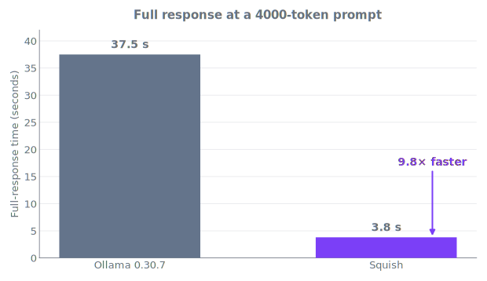
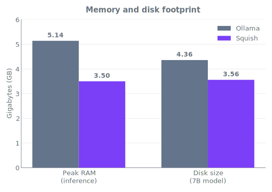
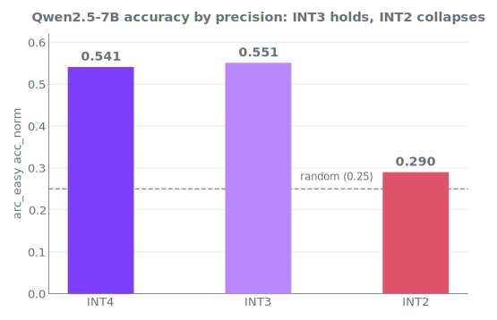

# I Couldn't Find a Local LLM Tool Fast Enough, So I Built My Own

*This requires Apple Silicon (M-series). If you're on Intel, Linux, or Windows, the numbers in this article will not apply to your hardware.*

**TL;DR:** Squish is a local LLM inference server for Apple Silicon, up to 9.8× faster than Ollama on long prompts. [Skip the story and install it →](#how-you-actually-use-it)

Since February, many of my commits have been written by a local AI in under two seconds. No API keys, no rate limits, no internet connection, and no data leaving my machine. Getting it working took considerable effort, but once it did, it's been very reliable across dozens of repositories. The local AI software I'm describing didn't exist, not without heavy modifications to source code you don't control, or building your own from scratch. So I built it, and it solved my problem. It may not solve yours, but you can clone it, fork it, take it apart, and have fun with it.

It started with Gemini. I wired the API to a script I wrote that automates git commits and pushes. It was fast and intelligent, until you hit the hard free tier rate limits. In my case, I hit them every day. Sometimes on the second commit, sometimes on the first. Gemini returns a response message saying you've been rate-limited. Use it once, use it twice, and you're cut off. This was for simple stuff, maybe 500 to 1,000 tokens for a commit, a little more for a large diff. I put up with it for a while, but the annoying limits drove me to drop it. I searched around but couldn't find anything that could solve my problem.

So I went local, off the cloud entirely, with no rate-limiting. I pointed the script at Ollama running Mistral and configured and tested it for weeks: built a custom Modelfile, iterated prompts, fine-tuned output until the commit messages described the diff accurately. The descriptions came out great. They also took too long. End to end, a response landed anywhere from seven to ten seconds on a normal commit, and north of a minute for a large diff. So I pulled every lever and turned every knob, but the adjustments failed to reduce the response time, and my problem was still unsolved. The slow and unpredictable responses were the hard wall. When the software is written by someone else, their speed limit is your speed limit. I wanted a coherent commit message in under five seconds, ideally under three. Ollama and the models it serves could not deliver. I thought about it for over a month and came to the conclusion that I had to build something myself. Something lean and elegant that doesn't just "work", it beats the baseline outright. That something is called Squish, a local AI inference server.

## What Squish Actually Is

**To be clear:** I did not build a model. I built the server that runs models, a framework that quantizes and compresses them, and a local format that reduces how much memory they need to run. Squish is an MLX-based local inference server, and three architectural components set it apart from existing tools:

**1. A persistent daemon that keeps the model awake.** Ollama loads its model lazily, on the first request, and that first request pays for it: twenty to thirty seconds of cold start while the weights load, before a single token comes back. Worse, the model gets unloaded once it sits idle, so an intermittent workflow pays that toll over and over. Squish loads the model once, when the daemon starts, and keeps it resident for as long as it's running. The cost is paid a single time; every request after is warm. Load once, never load again.

**2. A two-tier KV cache that remembers.** Before a model can answer a prompt, it runs prefill. It reads the entire prompt and builds the internal attention state required in memory before producing a single token. That memory state is called the KV cache. Normally the KV cache is discarded once a response is completed, and on the next request it gets rebuilt from scratch. Squish retains the KV cache, in two layers.

- **The prompt cache** handles exact repeats, an identical prompt sent again. If that prompt is resent, there's nothing to rebuild. Time-to-first-token (TTFT) drops to roughly 4 to 11 ms, versus about 192 ms to prefill from scratch.
- **The block cache** handles prompts that partially overlap previous prompts. The cache stores KV state in fixed-size blocks on disk. A block is computed only once. Any future prompt that contains overlapping blocks reuses the stored copy. This ensures the model only computes tokens it hasn't seen before. Examples include agent loops that resend a long system prompt each turn, and multi-turn conversations.

**3. INT3 quantization that genuinely works, on some models.** A model's knowledge lives in its parameters, also called weights, the values it learned during training. Quantization stores each parameter at lower precision, like rounding a long decimal to a couple of places. It saves memory and adds speed, but can cost accuracy. Three-bit quantization (INT3) is aggressive enough that it usually breaks a model outright. However, for some model families, INT3 is stable, more on that below.

## The Benchmarking Methodology

Before I present any numbers, I'll share my benchmarking protocol. Plenty of "Ollama vs X" articles contain at least one apples-to-oranges measurement that favors the tool the author is selling. The most overlooked one is thermal. Run the favored tool first on a cool machine, then run the competing tool second once the machine is hot. This manufactures a win out of nothing but execution order. So I controlled for it. Each inference server was measured from the same 50°C baseline. A consistency check confirmed the first and last runs were taken at the same chip temperature and held to within 1.7%, so performance didn't degrade as things heated up. The temperature of the chip's silicon (its die) was logged live throughout the benchmark tests. These numbers reflect each inference server, not the benchmark order.

**Hardware:** Apple M3 MacBook Pro, 16 GB unified memory, running macOS 26 Tahoe, the current OS version. Normal hardware, controlled procedure: no external memory, SSD, or compute, and no fresh reboot to game the result.

**Models:** Qwen2.5-7B-Instruct for both, Q4_K_M on Ollama and INT4/INT3 on Squish. The two models are comparable in parameter count and quantization level. Ollama shipped a major version jump partway through this project, so I ran the full suite against both 0.18.2 and 0.30.7. They came out identical, matching to a tenth of a token per second at short and medium context, so the comparison below isn't pinned to a single convenient version. The numbers that follow use 0.30.7, the current release.

**Protocol:** I ran five runs per metric, reported the median result value, and used identical prompts and lengths for both Ollama and Squish. The benchmarks included prompt sizes of 75, 2000, and 4000 tokens. 75-token prompts are what most benchmarks publish. Coding agents and document Q&A workloads are typically around 4000 tokens. The raw per-run JSON results are committed in the repo, and every number can be reproduced with an M3.

## The Honest Benchmark Comparison

With that protocol settled, here is how the two inference servers compare (apples-to-apples). Every number is reproducible from the repo via `benchmarks/ollama_vs_squish/bench_thermal_h2h.py`.

| Metric | Ollama 0.30.7 | Squish |
|---|---:|---:|
| Cold start: load + first token (1.5B) | 20–30 s | ≈0.5 s (54×) |
| Full response @ 4000-token prompt | 37.5 s | 3.8 s (9.8×) |
| Decode throughput @ 75 tokens | 20.3 tok/s | 24.0 tok/s (INT3) |
| Inter-token tail p95 @ 75 tokens | 52.4 ms | 42.7 ms (INT3) |
| Repeat-prompt TTFT (KV cache hit) | ~160 ms | 4–11 ms |
| Peak RAM during inference | 5.14 GB | 3.50 GB |
| Disk: 7B INT4 / INT3 | 4.36 GB / n/a | 4.00 / 3.56 GB |
| Cold short-prompt TTFT | 167 ms | 192 ms |

*Ollama 0.18.2 was tested identically. Its decode throughput and latency matched 0.30.7 to within noise, with one exception: cold short-prompt TTFT, where 0.18.2 measured 126 ms.*

Ollama wins one category, TTFT on a cold, completely unique short prompt, measuring 167 milliseconds compared to 192 ms for Squish. I have to give props where props are due: Ollama 0.30.7's TTFT is 25 ms faster. I tried to beat it, but quickly realized that 25 ms is something the end user doesn't notice the way they notice end-to-end response time. Squish wins on end-to-end response time. That's the metric that actually matters for my commit message use case.

So what is the trade-off for those 25 milliseconds? Let's say you have an agent resending the system prompt every turn. For a 4,000-token prompt, Ollama takes around 37.5 seconds to return a full response. Squish's full response returns in 3.8 seconds flat. It's 9.8× faster, and it's the difference between a tool that responds in a timely manner and one where users stare at the screen wondering why it hasn't responded yet.



*Full response at a 4000-token prompt. Squish returns in 3.8 s versus Ollama's 37.5 s, a 9.8× speedup on the thermally controlled run. Source: BENCHMARKS.md.*



*Memory and disk footprint. Squish uses less peak RAM (3.50 vs 5.14 GB) and less disk for a 7B model (3.56 vs 4.36 GB). Source: BENCHMARKS.md.*

## The Most Interesting Thing I Found

I wanted local models to run faster and use less memory. I started with INT4 quantization, which is well studied and a stable standard. But I wanted to know exactly how small the models would compress, so I tried quantizing using INT3. Most models broke. Qwen2.5-7B didn't. The INT3 quantized model remained stable, and tied INT4 on the arc_easy reasoning benchmark. The scores were 0.551 to 0.541, INT3 slightly ahead but within the margin of error. The INT3 model decodes roughly 18% faster and compresses the model from 4.00 GB to 3.56 GB on disk. The rest of the Qwen model family remained stable using INT3, remaining within roughly 1% of the original model's performance. I also quantized Gemma-3 using INT3, and it collapsed, a fifteen-point drop in accuracy.

The Qwen model family could handle INT3, in some cases marginally beating INT4 within the margin of error. With that finding in hand, I wanted to find the actual floor, so I moved on to INT2. Qwen broke, and for good reason. The model I tested started spitting out gibberish in response to my prompt, "`IFYINGIFYIN`", completely incoherent, basically random. When a 16-bit model is crushed down to 2 bits, its intelligence is lost. Aggressive quantization has a hard floor, and eventually every model breaks. That breaking point is different for every model and every model family. That's why Squish has a quantization safety mechanism that blocks INT3 for the families it fails on and INT2 altogether. The result is a tool that compresses every model as far as it can safely go, and no further.



*arc_easy acc_norm by precision. INT3 holds (0.551, tied with INT4 at 0.541); INT2 collapses to 0.290, at the random baseline. Source: BENCHMARKS.md.*

## How You Actually Use It

There are many ways to use Squish, but at its most basic level it serves an OpenAI API on a local port (11435). I built it as a drop-in replacement for Ollama and for any application that speaks the OpenAI API endpoint spec.

Installing Squish via Homebrew is recommended. Nothing compiles, and every dependency comes bundled:

```bash
brew tap konjoai/squish
brew install squish
```

Or through Python:

```bash
pip install squish-ai    # Python 3.11–3.14 required - OR
pipx install squish-ai --python python3.13    # Isolated in its own environment
```

It runs on macOS 13 or later, and the Rust quantizer that does the heavy lifting installs itself.

With Squish installed, start a model with `squish run`. Specifying a model is optional. With no argument, Squish pulls a default sized to your machine's RAM, so you get the largest model that comfortably fits.

```bash
squish run    # or specify a model, e.g. squish run qwen2.5:7b
```

Behind the scenes on that first run, Squish pulls a pre-squished model from the Squish Hugging Face, the conversion and accuracy-gating already done, then loads and serves it. Once the model is loaded and ready, the web UI opens automatically.

A caveat before you go looking for models: Squish doesn't run every model, only those in MLX format (fp16 or bf16 weights). More on that in the next section.

With the server running, point any OpenAI client at it. Set your base URL to the local endpoint and use `squish` as the API key:

```bash
export OPENAI_BASE_URL=http://localhost:11435/v1
export OPENAI_API_KEY=squish
```

Ollama clients work too: point `OLLAMA_HOST` at the same port and they won't know the difference.

From there, several ways to work with the running model:

- **The web UI**, a chat client backed by a live instrument panel: the KV cache filling and reusing in real time, a quantization comparator, a latency waterfall splitting prefill from decode, and Apple Silicon power telemetry.
- **The VS Code extension**, the same chat plus agentic features and repo access, right in your editor.
- **The macOS app**, in two parts: a menu bar showing the Squish logo and live tokens per second, and a chat window for talking to the loaded model.
- **The command line**, POSTing directly to the OpenAI API endpoint.

Here are the basic Squish CLI commands:

```bash
squish run        # start the server (auto-picks a model for your RAM)
squish pull       # download and compress a model for your machine
squish doctor     # check your environment is set up correctly
squish catalog    # browse available models
```

To keep the server always available, `squish daemon install` registers it to start at login. For the full command list, see the repo.

## What Squish Doesn't Do

Squish only runs on Apple Silicon (M-series). There is no support for CUDA, Intel, Windows, or Linux. These platforms, chips, and kernels are not on the roadmap. Squish's speed comes from the Mac's Metal and unified memory. If you're not on an M-series Mac, Squish will not work for you.

Squish doesn't run every model on Hugging Face. It works with models already in MLX format, the fp16 or bf16 weights the `mlx-community` organization publishes, which is the layout Apple's MLX framework expects. If a model is already in that format, you can point Squish's convert command at it, and it quantizes and packs the weights into Squish's own format. What you can't do is hand it an arbitrary checkpoint in some other layout and expect it to work.

## What I Actually Use It For Now

When I first started building Squish, my goal was to get my commit messages written quickly and without rate limits. I accomplished that goal and then some. My commit and pull request scripts still run against Squish. However, my agents now write many of those commits and PRs themselves. Now my local Squish workflow has grown to include:

- Private and local chat, every prompt and response stays on the machine.
- Local code review and codebase Q&A, the Squish agent reads my repo without a third party involved.
- A drop-in OpenAI endpoint for testing other applications against a real model, no API bill.
- Model benchmarking and inference metrics: TTFT, end-to-end latency, RAM/GPU utilization live in the web dashboard and VS Code extension.

Your workflow may not look like mine; everyone is different. Squish solves my problems, and it may or may not solve yours. But if you have more than 16 GB RAM, Squish can run larger models than I've been able to while using significantly less RAM and hard disk space. If you want to modify it, the source is available and every benchmark number is reproducible from the repo.

Thanks for taking the time to read this article. If you have any requests for models to add to the Squish Hugging Face, or any problems installing or running Squish, please open an issue on GitHub.
